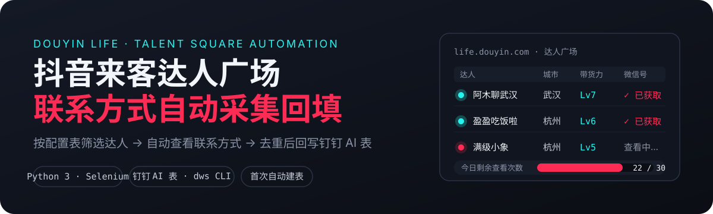
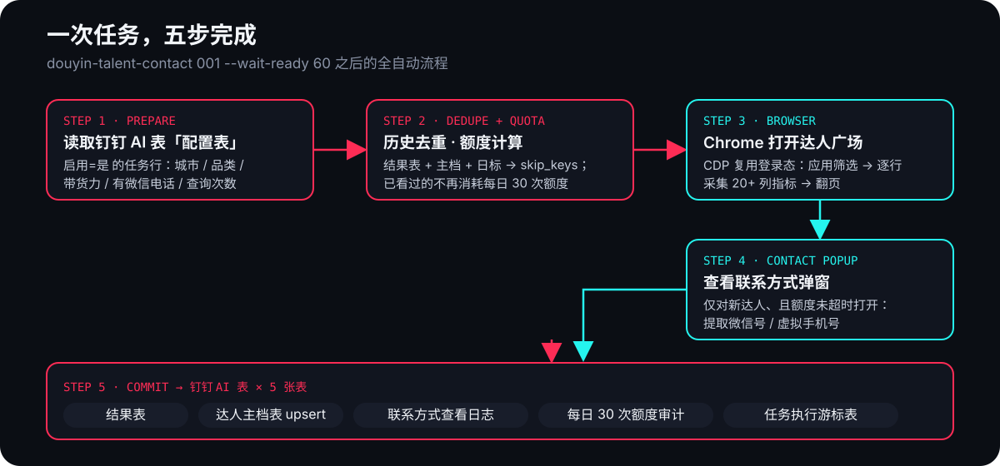
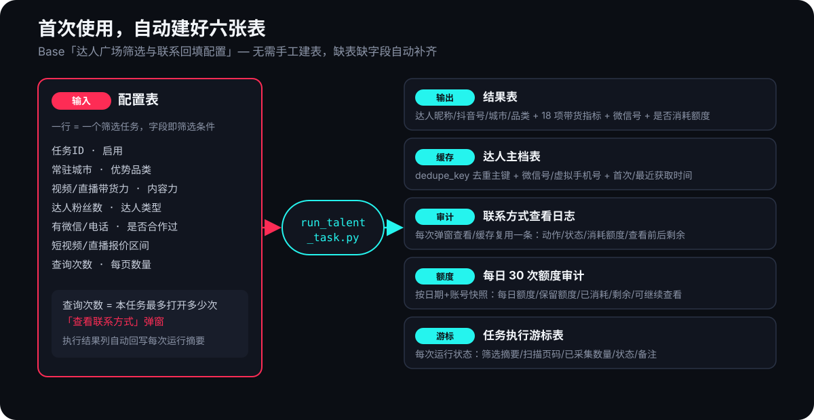

<p align="center">
  
</p>

# 抖音来客达人广场获取联系方式

一个可复用的本地自动化工具：在钉钉 AI 表里写一行筛选条件，脚本自动打开抖音来客达人广场、应用筛选、采集达人数据与联系方式，去重后回写六张钉钉 AI 表。**首次使用自动创建全部数据表，无需手工建表。**

## 核心特性

- **表格驱动**：筛选条件全部写在钉钉 AI 表「配置表」里，改表即改任务，不碰代码
- **首次自动建表**：第一次运行时自动在你的钉钉组织里创建 Base 与全部六张表（含字段），缺表缺字段自动补齐
- **额度保护**：「查看联系方式」每天有查看次数限制；已有联系方式的达人自动跳过，绝不重复消耗额度
- **历史去重**：按 `达人UID → 抖音号 → 昵称+城市+品类` 三级去重，跑过的达人不再重复采集
- **全链路落库**：结果、达人主档、查看日志、每日额度审计、任务游标五张表完整留痕

## 工作原理

<p align="center">
  
</p>

## 六张数据表

<p align="center">
  
</p>

## 快速开始

### 前置条件

1. 本机已安装 Python 3 和 Node.js（≥ 18）
2. 已安装 Selenium：`pip3 install selenium`
3. 已安装钉钉 CLI 并登录一次：

```bash
npm install -g dingtalk-workspace-cli
dws auth login
```

### 首次使用（自动建表）

直接跑一个任务，脚本会自动创建 Base「达人广场筛选与联系回填配置」和全部六张表：

```bash
python3 scripts/run_talent_task.py --task-id 001 --smoke --wait-ready 60
```

也可以先显式建表（推荐，方便先确认建在哪个组织）：

```bash
# 全新 Base + 六张表
python3 scripts/init_tables.py --create-base --write-config

# 或在已有 Base 内补齐六张表
python3 scripts/init_tables.py --base-id <你的BASE_ID> --write-config
```

表 ID 会写入本地配置 `~/.douyin-life-talent-contact/config.json`（参考 [`references/config.example.json`](references/config.example.json)）。

### 登录抖音来客

启动专用 Chrome（CDP 调试模式，端口 9222），并在这个窗口里登录一次抖音来客：

```bash
python3 scripts/launch_debug_chrome.py
```

### 配置任务

在钉钉 AI 表「配置表」里新增一行：

| 字段 | 示例 | 说明 |
| --- | --- | --- |
| 启用 | 是 | 只有 `是` 的任务会执行 |
| 任务ID | 001 | 命令行传入的编号 |
| 常驻城市 | 杭州 | 达人广场城市筛选 |
| 优势品类 | 美食 | 品类筛选 |
| 视频带货力 | Lv6,Lv7 | 支持多选 |
| 有微信/电话 | 是 | 优先筛有联系方式的达人 |
| 查询次数 | 1 | 本任务最多打开多少次联系方式弹窗 |

### 运行

```bash
# 安装短命令（可选）
python3 scripts/install_local.py

# 安全试跑：不点联系方式、不写表、不耗额度
douyin-talent-contact 001 --smoke --wait-ready 60

# 正式执行
douyin-talent-contact 001 --wait-ready 60
```

成功输出示例：

```json
{
  "ok": true,
  "task_id": "001",
  "opened_contacts": 1,
  "commit": {
    "add_count": 1,
    "planned_contact_view_consumption": 1
  }
}
```

## 去重与额度规则

脚本在采集前先读结果表、达人主档表、联系方式查看日志、额度审计四张表，计算 `skip_keys` 与可用额度：

- **去重顺序**：`达人UID` → `抖音号` → `达人昵称+达人城市+达人品类`
- **已有微信号的达人**：不再点击「查看联系方式」，不消耗每日额度
- **缓存复用**：主档/日志中有缓存联系方式但结果表还没有的，复用写入且 `是否消耗额度=否`
- **新达人**：只有在未超过配置表「查询次数」且每日额度未用完时才打开弹窗
- **不想消耗额度**：用 `--smoke`，或把「查询次数」设为 `0`

## 常见问题

<details>
<summary>命令找不到任务</summary>

报错 `No active config row found where 启用=是 ...` 时，检查配置表的 `启用` 是否为 `是`、`任务ID` 是否与命令一致。
</details>

<details>
<summary>页面停在达人广场但命令不继续</summary>

先运行 `douyin-talent-contact doctor --wait-ready 60`。若 `talent_square_ready=false`，通常是 Chrome 未登录、账号不对或 CDP Chrome 不是当前登录账号。
</details>

<details>
<summary>钉钉接口偶发超时</summary>

脚本已对 HTTP 5xx/429/超时做最多 3 次重试；持续失败通常是网络或钉钉服务临时异常，稍后重跑。
</details>

<details>
<summary>想接入自己的流程</summary>

本仓库的能力已按层拆分：`dws_client.py` 负责钉钉 AI 表读写（fieldId 转换），`sync_talent.py` 提供 `prepare / commit / verify / provision-schema` 子命令，可直接组合调用。
</details>

## 目录结构

```text
.
├── SKILL.md                     # Agent 技能定义（可直接交给 AI 助手执行）
├── scripts/
│   ├── dws_client.py            # 钉钉 dws CLI 封装（唯一对外接口层）
│   ├── init_tables.py           # 首次建表 / 补表（Base + 六张表）
│   ├── run_talent_task.py       # 任务编排：自动建表 → 采集 → 回写
│   ├── sync_talent.py           # 去重、额度、记录映射、回写
│   ├── douyin_browser_runner_selenium.py  # Selenium/CDP 浏览器采集
│   ├── launch_debug_chrome.py   # 启动 CDP 调试 Chrome
│   ├── install_local.py         # 安装 douyin-talent-contact 短命令
│   └── douyin-talent-contact    # 入口 wrapper
├── references/                  # 表结构说明与示例配置
├── tests/                       # 单元测试
└── assets/readme/               # README 插图（SVG 源文件）
```

## 敏感信息规则

以下内容**只**放在本地 `~/.douyin-life-talent-contact/config.json`，不要提交到仓库：

- 真实 `base_id` / `sheet_id`
- 真实商家账号名称
- 带真实 `groupid` 的抖音来客 URL
- token、cookie、手机号、微信号明细

## License

MIT
